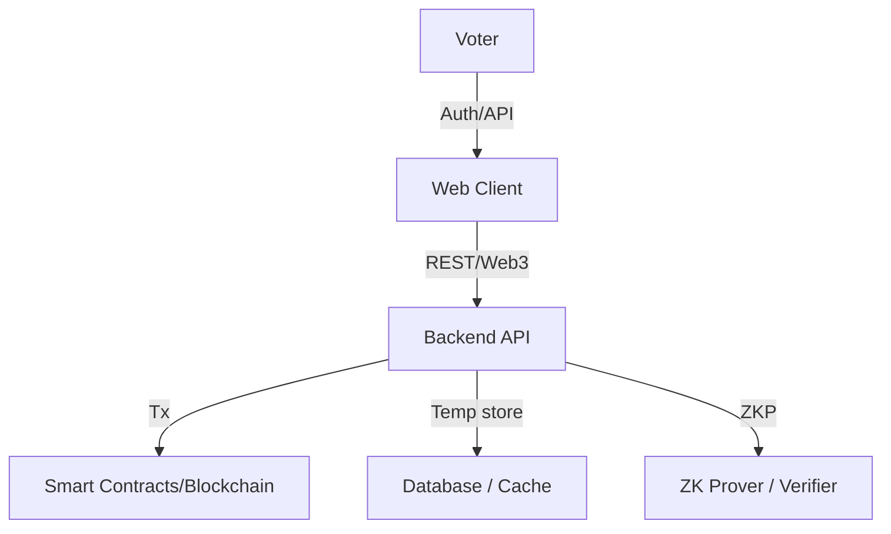

# VALOR — Verified Autonomous Ledger for Online Referendums

[](https://opensource.org/licenses/MIT)  
[](http://makeapullrequest.com)  
[](https://github.com/<your-github-username>/VALOR/actions)  
[](https://coveralls.io/github/<your-github-username>/VALOR?branch=main)

<div align="center">
  
  <p><strong>A secure, transparent, and scalable e-voting solution</strong></p>
</div>

[English](Readme.md) | [हिंदी](docs/README_hi.md)

## Table of contents
- [Quick start](#quick-start)
- [Project overview](#project-overview)
- [Problem](#the-problem)
- [Solution](#the-solution-valor)
- [Features](#features)
- [Architecture](#architecture)
- [Installation](#installation)
- [Environment example](#environment-setup)
- [Testing & CI](#testing--ci)
- [Contributing](#contributing)
- [License](#license)
- [Acknowledgments](#acknowledgments)

## Quick start

```bash
# Clone and run locally (Node.js >=16)
git clone https://github.com/<your-github-username>/VALOR.git
cd VALOR
npm install
cp .env.example .env
# edit .env as needed
npm run dev
```

## Project overview

VALOR is a blockchain + cryptography based online voting system that aims to provide:
- voter privacy
- tamper-evident public audit
- one-person, one-vote guarantees
- scalability and bilingual accessibility (English/Hindi)

It leverages homomorphic encryption, zero-knowledge proofs, and an immutable ledger for end-to-end verifiability.

## The problem

Common issues with current systems:
- Tampering risks
- Lack of independent transparency
- Duplicate/fake voting
- Heavy reliance on centralized trust
- Scalability & accessibility challenges

## The solution: VALOR

VALOR provides anonymous voter credentials, local ballot encryption, cryptographic nullifiers to prevent double-voting, ZK proofs for validity, and an auditable blockchain ledger.

## Features

| Feature | Description |
|---|---|
| Anonymous credentials | EPIC/DOB/phone verification → one-time anonymous credential |
| Secure auth | OTP + password flows; temporary encrypted identity handling |
| Local ballot encryption | Paillier (or alternative homomorphic scheme) before submit |
| Immutable ledger | Encrypted ballots + proofs stored on-chain |
| ZKPs | Prove ballot validity without revealing votes |
| End-to-end verifiability | Voter can confirm inclusion; public audit via explorer |
| Bilingual & scalable | UI supports Hindi/English; architecture designed for scale |

## Architecture


## Installation

### Prerequisites
```bash
node -v   # >= 16
npm -v    # >= 8
docker -v # optional, for containerized deployment
```

### Development
```bash
npm install
cp .env.example .env
# populate .env, then:
npm run dev
```

## Environment setup
See example below and keep secrets out of source control.

````env
// filepath: d:\gitdemo\VALOR\.env.example
NODE_ENV=development
PORT=3000
MONGODB_URI=mongodb://localhost:27017/valor
BLOCKCHAIN_RPC=https://polygon-mumbai.infura.io/v3/YOUR-PROJECT-ID
JWT_SECRET=change-this-to-a-secure-secret
TWILIO_ACCOUNT_SID=your-twilio-sid
TWILIO_AUTH_TOKEN=your-twilio-token
# Add any provider keys (do NOT commit real secrets)
````